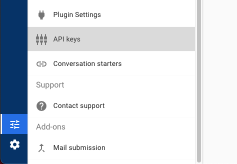

# zivverscim
Zivver Python pip module to CRUD accounts dynamically.
This library enables the use of SCIM to talk to [Zivver](https://www.zivver.com)

## Requirements
You will need to get the API key from Zivver to allow REST calls.

1. Generate API Keys, go to this URL [Generate API key](https://app.zivver.com/organization/api-keys)
or follow these steps:
   * In Zivver, go to Organization Settings -> API Keys
     
   * Click on Generate API Keys
     
     
   * Save the API Key, you will need the key to setup a connection to Zivver
     
2. Python >=3.6
3. Endpoint URLs to Zivver for CRUD actions.
   * Example endpoint: https://app.zivver.com/api/scim/v2/Users
    
## Install
Install via pip

    $: pip install zivverscim

## Testing
You should create an `.env` file, we already have added the `.env.dummy` file that you need to rename to `.env`.
Update the enviroment variables inside that file.

Clone this repo and install requirements:

    $: git clone git@github.com:Adapta-dev/zivverscim.git
    $: cd zivverscim
    $: pip install -r requirements.txt

Install Zivverscim locally:

    $: pip install -e .

Run the tests:

    $: python tests/crud_accounts.py

## Exceptions
Use the custom `ZivverCRUDError` object to get the exception messages:

```python
ZivverCRUDError.get_message()           # Returns the error message
ZivvZivverCRUDError.get_sollution()     # Returns the possible sollution
```

## Create account
Before you do anything in Python with Zivver, you will need to import the Zivver library:

```python
from zivverscim import scim_connection_crud
# ...
```

create a new Zivver Scim Connection Object:

```python
zivver_scim_connection = scim_connection_crud.ZivverSCIMConnection(
    external_oauth_token_value=self.external_oauth_token.token_value,    # Generated API key
    scim_api_create_url='https://app.zivver.com/api/scim/v2/Users/',     # Endpoint URL from Zivver
    scim_api_update_url='https://app.zivver.com/api/scim/v2/Users/',     # Endpoint URL from Zivver
    scim_api_get_url='https://app.zivver.com/api/scim/v2/Users/',        # Endpoint URL from Zivver
    scim_api_delete_url='https://app.zivver.com/api/scim/v2/Users/',     # Endpoint URL from Zivver
)
```

You can use the `zivver_scim_connection` object to create new accounts:

```python
zivver_user_object = zivver_scim_connection.create_user_in_zivver(
    first_name='John',
    last_name='Doe',
    nick_name='{} {}'.format('John', 'Doe'),
    user_name='john@gmail.com',
    zivver_account_key='john@gmail.com',
    sso_connection=True,                          # Only if SSO is enabled
    is_active=True                                # If the user should be active upon creation
)

print(zivver_user_object)                         # Prints a json represetation of the object
```

You can also use `aliases` and `delegates` attributes to append those:

```python
zivver_user_object = zivver_scim_connection.create_user_in_zivver(
    # ...
    aliases=['john.doe@gmail.com'],               # Alias for current user
    delegates=['manager@gmail.com']               # Delegate access for other users
)
```

## Reference
Create accounts:

```python
zivver_user_object = zivver_scim_connection.create_user_in_zivver(
    first_name='John',
    last_name='Doe',
    nick_name='{} {}'.format('John', 'Doe'),
    user_name='john@gmail.com',
    zivver_account_key='john@gmail.com',
    sso_connection=True,                        # Only if SSO is enabled
    is_active=True,                             # If the user should be active upon creation
    aliases=['john.doe@gmail.com'],             # Alias for current user
    delegates=['manager@gmail.com']             # Delegate access for other users    
)
```
Update accounts:

```python
zivver_user_object = zivver_scim_connection.update_user_in_zivver(
    account_id='12412412-4124124124-12412412412-124124412241',
    first_name='John',
    last_name='Doe',
    nick_name='{} {}'.format('John', 'Doe'),
    user_name='john@gmail.com',
    zivver_account_key='john@gmail.com',
    sso_connection=True,                    # Only if SSO is enabled
    is_active=True,                         # If the user should be active upon creation
    aliases=['john.doe@gmail.com'],         # Alias for current user
    delegates=['manager@gmail.com']         # Delegate access for other users    
)
```


Get one account:

```python
zivver_user_object = zivver_scim_connection.get_user_from_zivver(account_id=zivver_user_object.account_id)
```
Get bulk accounts

```python
zivver_users_object = zivver_scim_connection.get_all_users_from_zivver()
```
Delete account

```python
zivver_scim_connection.delete_user_from_zivver(account_id=zivver_user_object.account_id)
```

### zivver_users_object
Zivver returns a `zivver_users_object` object containing the account information.
The most important one is the account_id, which you will need to update/get/delete the existing account.

The `account_id` is a UUID randomly generated by Zivver, so save it.

```python
class ZivverUser:
    """
    ZivverUser Class object created from the ZivverUser create/update response
    """
    
    def __init__(self, account_id=None, name_formatted=None, meta_created_at=None, meta_location=None,
                 meta_resource_type=None, phone_numbers=None, user_name=None, nick_name=None, is_active=False,
                 schemas=None, enterprise_user=None, zivver_scim_user_aliases=None, zivver_scim_user_delegates=None):
        self.account_id = account_id
        self.name_formatted = name_formatted
        self.meta_created_at = meta_created_at
        self.meta_location = meta_location
        self.meta_resource_type = meta_resource_type
        self.phone_numbers = phone_numbers
        self.user_name = user_name
        self.nick_name = nick_name
        self.is_active = is_active
        self.schemas = schemas
        self.enterprise_user = enterprise_user
        self.zivver_scim_user_aliases = zivver_scim_user_aliases
        self.zivver_scim_user_delegates = zivver_scim_user_delegates
    
    #...
```

# Contribution
Adapta welcomes any contributions to the open source ZivverSCIM library, so feel free to contribute.

## Issues
Feel free to submit issues and enhancement requests.

### Contributing (how to)
Please refer to each project's style and contribution guidelines for submitting patches and additions. In general, we follow the "fork-and-pull" Git workflow.

1. **Fork** the repo on GitHub
2. **Clone** the project to your own machine
3. **Commit** changes to your own branch
4. **Push** your work back up to your fork
5. Submit a **Pull request** so that we can review your changes

NOTE: Be sure to merge the latest from "upstream" before making a pull request!

## Copyright and Licensing
The Zivverscim library software is licensed under GNU GENERAL PUBLIC LICENSE V3.0
